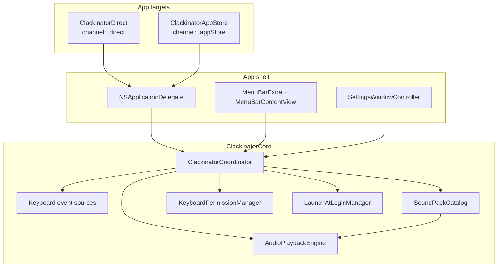
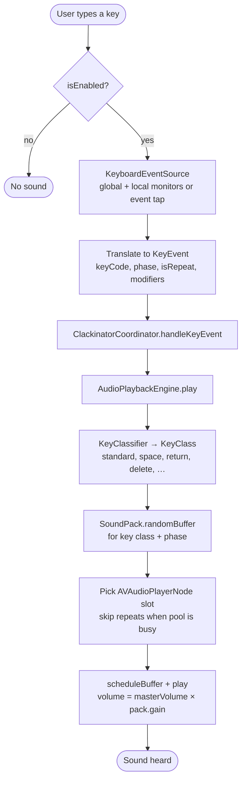
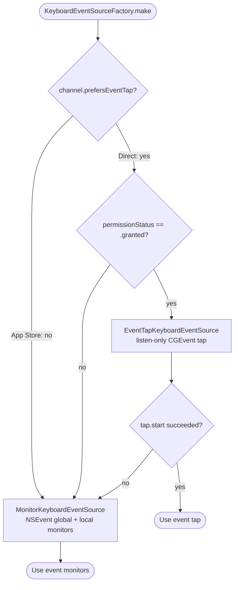
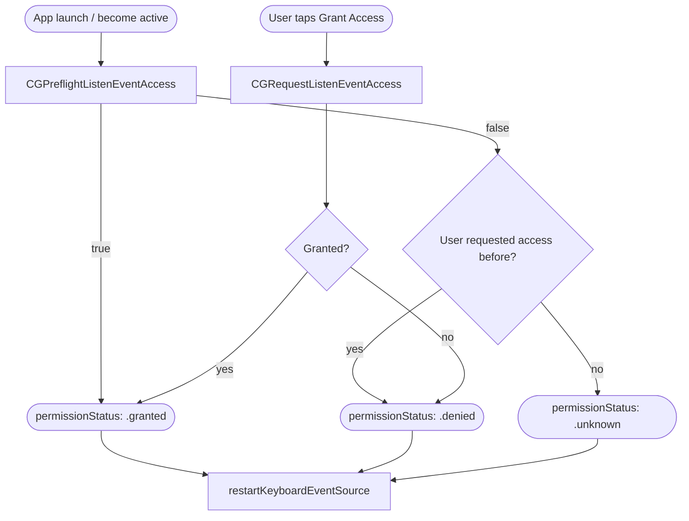
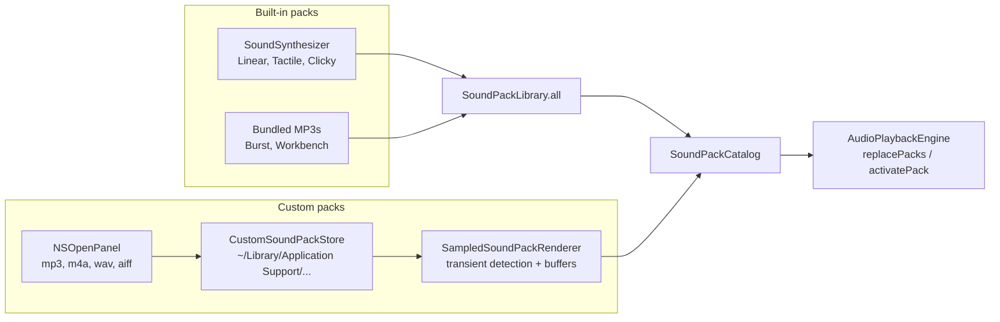
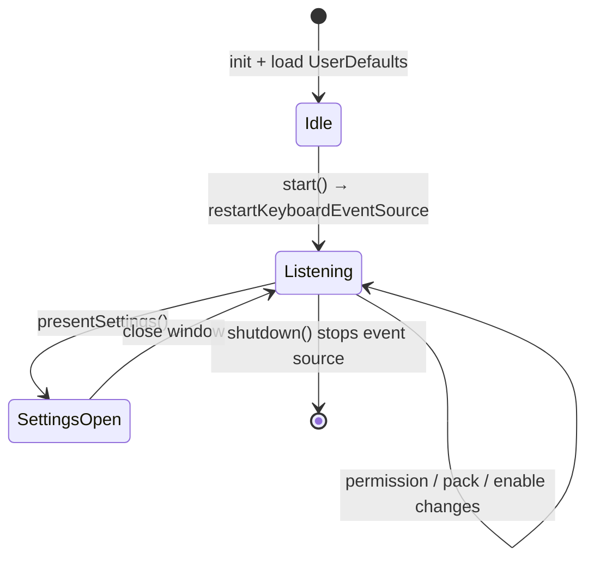
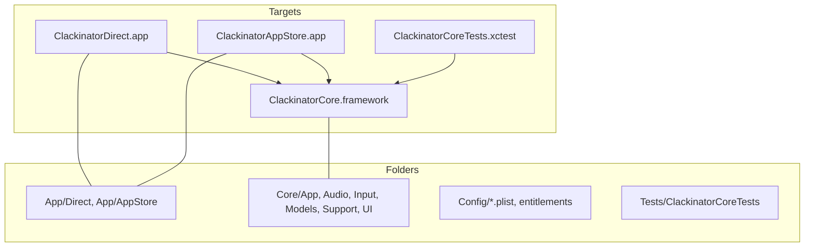

# Clackinator

Clackinator is a native macOS menu bar utility that plays mechanical-style keyboard sounds while you type. The repository ships two app targets that share one framework:

| Target | Bundle ID | Distribution |
|--------|-----------|--------------|
| `ClackinatorDirect` | `com.clackinator.direct` | Developer ID signing, Homebrew cask, notarized zip |
| `ClackinatorAppStore` | `com.clackinator.appstore` | Sandboxed Mac App Store validation path |

Shared behavior lives in the **`ClackinatorCore`** framework: global key capture, sound packs, low-latency playback, onboarding, permissions, and launch-at-login.

## Getting started

1. Regenerate the Xcode project (required after adding or removing Swift files):
   ```bash
   ruby ./script/generate_xcodeproj.rb
   ```
2. Build and run the direct target:
   ```bash
   ./script/build_and_run.sh
   ```
3. Open settings from the menu bar icon and grant **Input Monitoring** (keyboard listening) access so sounds play in other apps.

Optional: stream unified logs while developing:

```bash
./script/build_and_run.sh --telemetry
```

## Documentation

Developer-facing docs live in [`docs/`](docs/README.md):

- [`docs/developer-guide.md`](docs/developer-guide.md) covers project generation, targets, local debugging, permissions, and tests.
- [`docs/customization.md`](docs/customization.md) covers sound packs, settings, channel-specific behavior, and privacy boundaries.
- Existing release docs remain in [`docs/release.md`](docs/release.md) and [`docs/app-store-validation.md`](docs/app-store-validation.md).

## High-level architecture

The app shells are thin SwiftUI `MenuBarExtra` wrappers. All product logic runs in `ClackinatorCoordinator`, which wires input, audio, permissions, and UI together.



## Runtime: from keystroke to sound

When typing sounds are enabled and a key event arrives, the coordinator forwards it to the audio engine. The engine classifies the key, picks a sample for the active pack and phase (down/up), and schedules playback on one of several pooled `AVAudioPlayerNode` instances.



## Keyboard capture backends

`KeyboardEventSourceFactory` picks how keys are observed. The **direct** build prefers a listen-only Quartz event tap when permission is granted; the **App Store** build always uses `NSEvent` monitors. If the tap fails to initialize, the factory falls back to monitors.



| Backend | Used when | Behavior |
|---------|-----------|----------|
| **Listen-only event tap** | Direct build + granted permission + tap init OK | `CGEvent.tapCreate` with `.listenOnly`; does not modify events |
| **Event monitor** | App Store build, denied/unknown permission, or tap fallback | `NSEvent.addGlobalMonitorForEvents` + local monitor |

Permission is checked via `CGPreflightListenEventAccess` / `CGRequestListenEventAccess` (Input Monitoring). Without it, global monitors do not deliver other apps’ keys; local capture still works inside Clackinator.



## Sound packs

Built-in packs come from two pipelines. **Synthesized** packs (`Linear`, `Tactile`, `Clicky`) are procedurally generated at startup from timbre recipes in `SoundSynthesis`. **Sampled** packs (`Burst`, `Workbench`) slice bundled MP3s in `Core/Audio/Resources/`. **Custom** packs import a user-provided audio file; `SampledSoundPackRenderer` detects transients and builds per–key-class, per-phase PCM buffers stored under Application Support.



Each `SoundPack` holds `AVAudioPCMBuffer` groups keyed by `(KeyClass, KeyPhase)`. At playback time, the engine requests a random buffer for the classified key; missing classes fall back to `.standard`.

| Pack ID | Source | Character |
|---------|--------|-----------|
| `linear` | Synthesis | Soft, low-resonance taps |
| `tactile` | Synthesis | Mid bump, woody click |
| `clicky` | Synthesis | Bright, short decay |
| `burst` | Sampled MP3s | Short typing bursts |
| `workbench` | Sampled MP3s | Longer, heavier desk feel |
| *(custom)* | User import | Sliced from one audio file |

## Coordinator and settings

`ClackinatorCoordinator` is the central `@MainActor` `ObservableObject`. It persists preferences to `UserDefaults`, drives the menu bar UI, and owns the keyboard source lifecycle.



| UserDefaults key | Purpose |
|------------------|---------|
| `isEnabled` | Master on/off for typing sounds |
| `selectedSoundPackID` | Active pack |
| `masterVolume` | 0…1 gain multiplier |
| `launchAtLoginEnabled` | `SMAppService.mainApp` registration |
| `hasCompletedOnboarding` | First-run settings prompt |
| `hasRequestedKeyboardPermission` | Distinguishes unknown vs denied permission |

On first launch, if onboarding is incomplete, settings open automatically after a short delay.

## Xcode project layout

`Clackinator.xcodeproj` is **generated** by `script/generate_xcodeproj.rb` (not hand-edited). CI fails if regeneration produces a diff—always commit the updated project after file changes.



| Path | Contents |
|------|----------|
| `App/Direct/` | `ClackinatorDirectApp`, `DirectAppDelegate` |
| `App/AppStore/` | `ClackinatorAppStoreApp`, `AppStoreAppDelegate` |
| `Core/App/` | `ClackinatorCoordinator`, `SettingsWindowController` |
| `Core/Audio/` | Playback, packs, synthesis, sampled renderer, bundled MP3s |
| `Core/Input/` | Event tap, monitors, classifier, factory |
| `Core/Models/` | `KeyEvent`, `KeyClass`, `AppChannel` |
| `Core/Support/` | Permissions, logging, launch-at-login |
| `Core/UI/` | Menu bar and settings SwiftUI views |
| `Tests/ClackinatorCoreTests/` | Unit tests for coordinator, audio, classifier, custom packs |
| `Config/` | Per-target Info.plist and App Store entitlements |
| `script/` | Project generation, local build, release packaging, Homebrew cask template |
| `Homebrew/Casks/` | ERB template for `clackinator.rb` |
| `.github/workflows/` | CI and manual direct-release workflow |
| `docs/` | [Release guide](docs/release.md), [App Store validation gate](docs/app-store-validation.md) |

**Deployment target:** macOS 14.0 · **Swift:** 5.0 with minimal strict concurrency

## CI and release automation

```mermaid
flowchart TD
    subgraph CI["CI workflow (push/PR)"]
        Checkout --> Gen["generate_xcodeproj.rb"]
        Gen --> Diff["git diff --exit-code"]
        Diff --> TestDirect["xcodebuild test<br/>ClackinatorDirect"]
        TestDirect --> BuildStore["xcodebuild build<br/>ClackinatorAppStore"]
    end

    subgraph Release["Direct Release (workflow_dispatch)"]
        RCheckout --> RGen["Regenerate project"]
        RGen --> Package["package_direct_release.sh"]
        Package --> SHA["SHA256 zip"]
        SHA --> Cask["render_homebrew_cask.rb"]
        Cask --> GHRelease["GitHub release assets"]
    end
```



| Workflow | Trigger | What it does |
|----------|---------|--------------|
| [`.github/workflows/ci.yml`](.github/workflows/ci.yml) | Push to `main`, all PRs | Regenerate project, verify commit is clean, test Direct, build App Store (unsigned) |
| [`.github/workflows/direct-release.yml`](.github/workflows/direct-release.yml) | Manual | Sign, notarize, zip, render Homebrew cask, publish release |

Local direct release steps are documented in [docs/release.md](docs/release.md). App Store sandbox validation is in [docs/app-store-validation.md](docs/app-store-validation.md).

## Local development scripts

| Script | Purpose |
|--------|---------|
| `script/generate_xcodeproj.rb` | Rebuild `Clackinator.xcodeproj` from filesystem layout |
| `script/build_and_run.sh` | Build Debug `ClackinatorDirect`, open app (`--debug`, `--logs`, `--telemetry`) |
| `script/package_direct_release.sh <version>` | Archive, sign, notarize, export zip |
| `script/render_homebrew_cask.rb` | Fill `Homebrew/Casks/clackinator.rb.erb` for a tap |

## Logging

Structured logging uses `os.Logger` via `ClackinatorLogger` categories: `app`, `audio`, `input`, and `permissions`. Filter in Console.app or `./script/build_and_run.sh --telemetry`.

## Testing

Run unit tests through Xcode or CI:

```bash
xcodebuild \
  -project Clackinator.xcodeproj \
  -scheme ClackinatorDirect \
  -destination "platform=macOS" \
  CODE_SIGNING_ALLOWED=NO \
  test
```

Tests cover the coordinator, sound pack library/catalog, key classification, sampled renderer behavior, and custom pack storage—without requiring real global keyboard access in most cases.

## Further reading

- [docs/release.md](docs/release.md) — local dev, Homebrew/direct release, App Store archive flow
- [docs/app-store-validation.md](docs/app-store-validation.md) — sandbox permission and cross-app typing checklist before MAS ship
